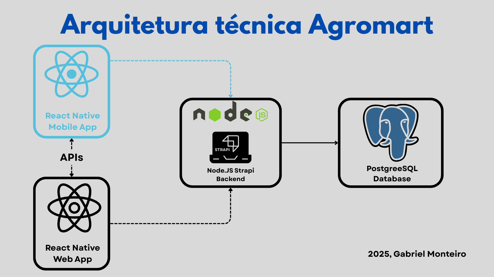
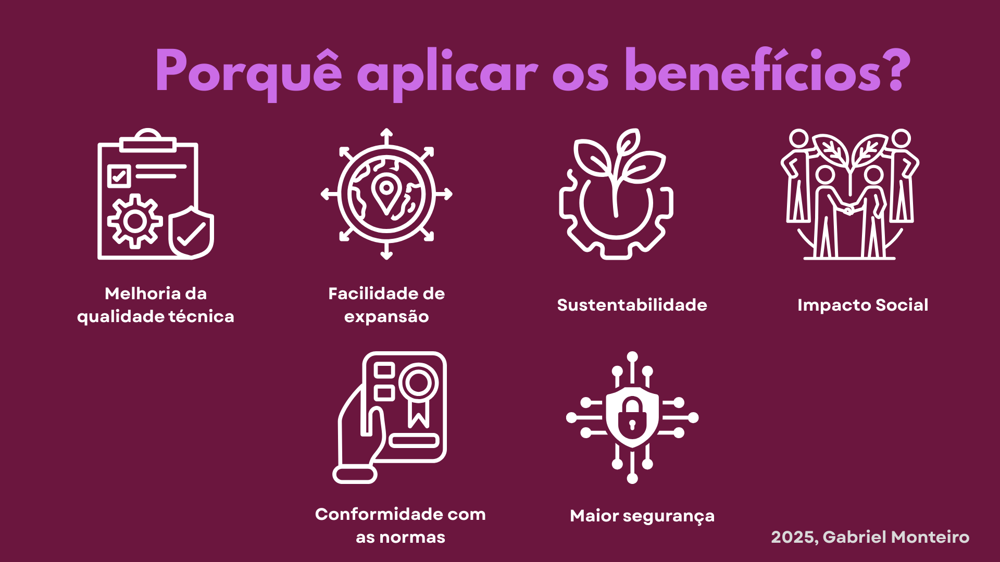

# Fase 1 - Estabelecer os Requisitos de Avaliação de Qualidade

## 1. Propósito da avaliação

### 1.1 Produto analisado
**Nome do Produto:** AgroMart  
**Versão:** 1.0 (em desenvolvimento contínuo)  
**Repositório:** https://github.com/AgroMart  
**Domínio:** Agronegócio/Agricultura Familiar  

#### Resumo do projeto

O AgroMart é uma plataforma digital inovadora criada para conectar agricultores familiares a consumidores, facilitando a comercialização de produtos agrícolas através do modelo CSA (Comunidades que Sustentam a Agricultura). O projeto surgiu em 2020 durante um hackathon na UnB-FGA com o tema "Cultivando Conexões", sendo desenvolvido para atender às necessidades acentuadas pela pandemia de COVID-19.

A solução engloba uma interface web para os agricultores e um aplicativo mobile multiplataforma para os consumidores, proporcionando ao pequeno agricultor uma maior garantia para o escoamento de sua produção e ajudando pessoas que buscam uma alimentação mais saudável.

#### Arquitetura

O AgroMart utiliza-se da seguinte arquitetura:

- **Frontend Web:** React
- **Frontend Mobile:** React Native (iOS e Android)
- **Backend:** Node.js com Strapi
- **Banco de Dados:** PostgreSQL

 Arquitetura do Agromart

 Autor: Gabriel Monteiro, 2025

### 1.2 Objetivo da avaliação
**Objetivo Principal:** Avaliar a qualidade do software AgroMart com foco específico em **portabilidade** e **conformidade**, conforme a disciplina, com o objetivo de pontuar pontos positivos e possíveis pontos de melhoria da plataforma.

**Objetivos Específicos:**
- Avaliar a capacidade de portabilidade do sistema entre diferentes plataformas e ambientes
- Verificar conformidade com padrões e normas de qualidade de software (ISO/IEC 25010)
- Identificar oportunidades de melhoria na arquitetura demonstrada acima
- Identificar se há a compatibilidade entre diferentes sistemas

### 1.3 Aspectos a serem avaliados
Baseado na norma ISO/IEC 25010, essa análise visa focar mais nos aspectos de portabilidade e conformidade, além de passar com um foco menor na parte de compatibilidade da plataforma, no qual o nível de interesse (entre 1 e 5) será destacado na tabela abaixo:

| Aspecto de Qualidade | Nível de Interesse        | Justificativa |
|----------------------|---------------------------|---------------|
| **Portabilidade** | 5 | Foco principal - capacidade de operar em diferentes plataformas (iOS, Android, Web) |
| **Conformidade** | 5 | Foco principal - aderência a padrões ISO/IEC 25010 e normas de qualidade |
| **Compatibilidade** | 4 | Interoperabilidade entre sistemas web e mobile |
| **Manutenibilidade** | 2 | Facilidade de evolução e correção do código, não é o interesse dessa avaliação |
| **Confiabilidade** | 2 | Capacidade de manter desempenho sob diferentes condições, secundário por ser difícil de rodar a plataforma no momento |
| **Usabilidade** | 2 | Aspecto secundário para esta avaliação específica, secundário por já ter muitas pesquisas sobre |
| **Eficiência de Performance** | 2 | Aspecto secundário para esta avaliação |
| **Segurança** | 2 | Aspecto secundário para esta avaliação |

## 2. Planejamento

- **Planejamento da Avaliação:** Definir cronograma, recursos e meta
- **Documentação:** Documentar aqui todos os aspectos avaliados

#### 2.1. Partes analisadas

**Qualidade da plataforma:**
- **Portabilidade:** Adaptabilidade aos diferentes hardwares
- **Conformidade:** De acordo aos padrões da ISO

**Qualidade para os usuários:**
- **Efetividade:** Capacidade de fazer determinadas tarefas
- **Satisfação:** O quanto a plataforma agrada os usuários

## 3. Relação com as ODS

**ODS 2 - Acabar com a fome:**

- Facilita a distribuição da agricultura familiar
- Impulsiona um sistema alimentar sustentável

**ODS 12 - Consumo e produção responsáveis:**

- Promove cadeias curtas de comercialização
- Incentiva consumo consciente e local

**ODS 17 - Parcerias e meios de implementação:**

- Utiliza tecnologia para desenvolvimento sustentável
- Promove conhecimento e capacitação tecnológica

 Benefícios da avaliação da disciplina

 Autor: Gabriel Monteiro, 2025

## 4. Dados para a avaliação e ferramentas necessárias

### 4.1 Dados para Avaliação

- **Código Fonte:** Repositórios GitHub com histórico de commits e branches
- **Documentação:** Documentação do GitHub
- **Métricas de Código:** Análise dada pelo ESLint

### 4.2 Requisitos de Execução

**Hardware:**

- Computador com algumas plataformas (Chrome, Firefox, Edge e Brave)
- Dispositivos móveis iOS e Android para testes
- Internet

**Software:**

- Sistema operacional: Windows e Linux
- Navegadores
- As linguagens de programações necessárias para rodar

## Referências Bibliográficas

- ONU – Organização das Nações Unidas. *Objetivos de Desenvolvimento Sustentável (Agenda 2030)*. Disponível em: [https://brasil.un.org/pt-br/sdgs](https://brasil.un.org/pt-br/sdgs). Acesso em: 11 jul. 2025.

## 📝 Histórico de Versões

| Versão | Data | Descrição | Autor(es) |
| ------ | ---- | --------- | --------- |
| 1.0    | 12/07/2025 | Criação documento da fase 01 | [Gabriel Monteiro](https://github.com/GabrielSMonteiro) 